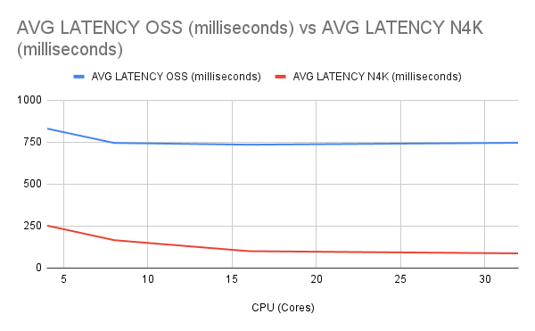
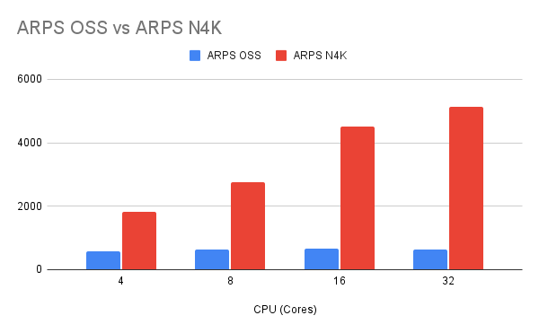
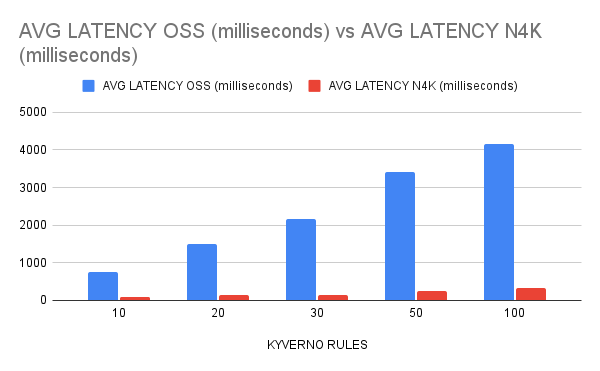
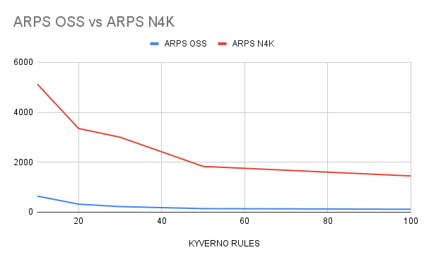

# Load and Scale Tests

## Setup

Instructions on running scale testing can be found [here](setup/setup.md).

## Results Summary

### Recommendations

Here are some general recommendations for tuning the system:

1. Baseline your current environment without any policies based on different variables (node type, API server, ETCD configuration, and storage)
2. Decide on the policies you need to deploy.
3. The `LATENCY` and the `ARPS` are `CPU` and `Kyverno replicas` functions. Memory plays little role here.
4. The actual scale results may also vary depending on the number of replicas of the apiserver and their configurations.
5. Kyverno can be scaled horizontally and vertically. With high requests, performance is better with horizontal scaling compared to vertical.
6. As `LATENCY` and `ARPS` depend on CPU, it is recommended to deploy an HPA that can scale Kyverno replicas based on the CPU usage of the Kyverno pods.

### N4K vs Kyverno OSS

Here are charts comparing the average latency and ARPS for Kyverno OSS 1.10 and N4K 1.10. 

#### Average latency with 10 Rules, 3 Kyverno replicas, 2Gi memory, 500 VUs and 5000 iterations

#### ARPS with 10 Rules, 3 Kyverno replicas, 2Gi memory, 500 VUs and 5000 iterations

#### Average latency with varying rule counts and 3 Kyverno replicas, 2Gi memory, 32 Cores CPU, 500 VUs and 5000 iterations

#### ARPS with varying rule count and 3 Kyverno replicas, 2Gi memory, 32 Cores CPU, 500 VUs and 5000 iterations

## Achieving target results of 200ms average latency and 5000 ARPS

In our test [environment](setup/setup.md), the number of rules that could be deployed was 25 to achieve the target of 200ms and 5000 ARPS. 

These results were based on observations with `5` Kyverno replicas, `32` Cores CPU Limits, `2Gi` Memory Limits with `500` VUs and `5000` iterations. The tunables here are CPU limits for Kyverno, the number of Kyverno replicas, and VUs. Using 10 replicas with 16 Cores each yielded better performance. 

Detailed performance results are available in the [results folder](results):
- [Kyverno OSS vs N4K Performance.csv](): Compares Kyverno OSS with N4K by varying rule counts, replicas and CPU
- [n4k_performance_horizontal.csv](): Shows N4K vertical scaling by varying rule counts, replicas and CPU 
- [n4k_performance_vertical.csv](): Shows N4K horizontal scaling by varying rule counts, replicas and CPU

The results can also vary depending on the number of API-server replicas and other configurations of control plane components. 

The policy rule type and conditional logic will also impact the results. 
